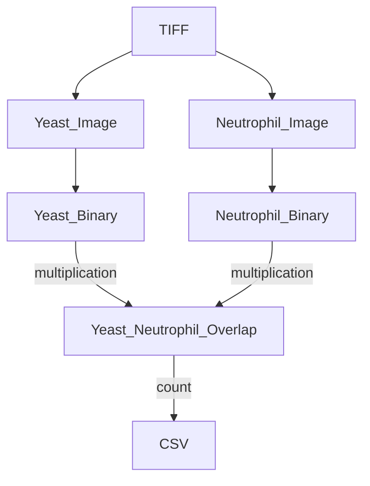
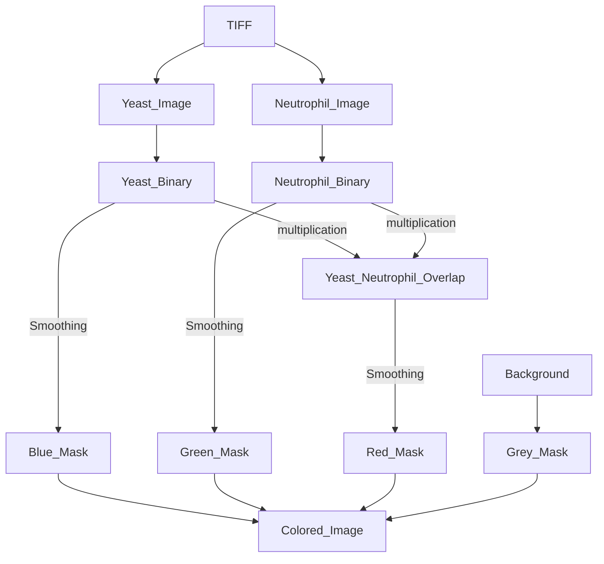

# Phagocytometer 

###### By Zach Jaffery, v1.1.0

### About

This program was made to aid in processing timelapse images from epi-fluorescence microscopy, specifically yeast-neutrophil movies.

### Necessary Packages

The program is built completely with python, so this must be downloaded and installed. 
Additionally, several python packages are required (numpy, pandas, cv2, Tkinter, and CustomTkinter). To install them, paste the following code into your terminal:

    pip install numpy
    pip install pandas
    pip install opencv-python
    sudo apt-get install python3-tk
    pip install customtkinter
    
Alternativally, the packages can manually be downloaded and installed, but ``pip`` function that comes automatically with python is much simpler. 

### Usage

To run the program, navigate to the "Phagocytometer.py" file and open it in IDLE3 (should come with python). Go to the 'Run' Tab and press 'Run Module' (Hotkey F5 by default). The program should then open, and you can proceed with processing.

### Methodology

First, a TIFF file is separated into its component images, which are then thresholded using [Otsu's Method](https://en.wikipedia.org/wiki/Otsu's_method). The cells in the images are counted, and then the binary neutrophil and binary yeast images are multiplied, yielding a binary image where only overlap between the yeast and neutrophil have a value of 1. After pre-processing to clean up the multiplied image, it is counted, yiedling a crude value for the number of neutrophil-yeast interactions in a given frame. Compared to human-counted images, the program returns a slightly lower number of interactions, so the option to use an experimentally determined scale factor is available.

Alternate methods for determining phagocytosis, such as looking for complete enclosure of a yeast by a neutrophil, is being explored.

Color mapping provides a visual display of neutrophil-yeast interactions, and may help to expedite human counting by simplifying the image being analyzed. The process is similar to the counting algorithm but utilizes some additional operations and processing to give a four distinct colored sections.

##### Counting Workflow

##### Coloring Workflow

### Coming Soon

* .nd2 processing
* channel customization