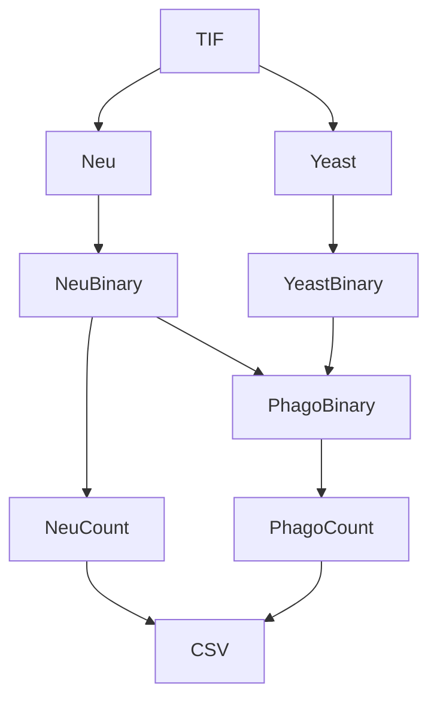

# Phagocytometer

This program was made to expedite counting cells after imaging. Images are taken with neutrophils stained one color and yeast stained another, then the painstaking task of counting each image is performed. With this program, you can run some code and receive a CSV of cell counts for each photo taken.

To download the program, [go to source code](https://github.com/zachjaffery/phagocytometer), click "Code," and "Download Zip."

## Installation

The program relies on python, so prior to use python and the required libraries must be installed. You can find this at [python.org](python.org). The program was built in version 3.9.1, but may work on other versions.

Additionally, several packages are required. The package installer 'pip' shoudld come automatically with python, but follow instruction at [https://packaging.python.org/en/latest/tutorials/installing-packages/](https://packaging.python.org/en/latest/tutorials/installing-packages/) to ensure you have it.

Then, in the terminal (Windows Key + X -> Terminal), paste and run the following code:

```
pip install numpy
pip install pandas
pip install opencv-python
pip install tk
pip install customtkinter
```


## Usage
Open the TIF file you want to read. NOTE: The program assumes that the order of the channels in the TIF stack are 1) blue, 2) DIC, 3) green. This is important because the channels need to be separated to be analzyed. If the TIF file has a different order, then the program in its current state will not give the desired result. 

You also may want to choose a name for the CSV file being created. If no name is given, the program will return a file name with the current date and time.

### Batch Processing

If you click on the button in the lower left corner, the batch processing dialog will open. You can select as many TIFs as you want, and the program will count them all. Currently, file name is set to "batch_1," "batch_2," etc. 

## Methodology 

A brief explanation of how the code works:
1. Split the tiff file into individual images, ignoring the DIC channel
2. For each image, calculate the Otsu threshold value (https://en.wikipedia.org/wiki/Otsu%27s_method) and use that to make a binary image. A binary, as the name implies, contains two values, white and black. White is where cells are, black is where cells aren't. A Gaussian blur may also be applied to make a better binary.
3. To count the neutrophils, the code counts every continous white section (per [this code](https://stackoverflow.com/a/47570902/24016481) from user *alkasm*)
4. Counting phagocytosis
a. First, the neutrophil binary and yeast binary are multiplied. Since the value of white is 1 and the value of black is 0, the product of two binary images is white only where both images were white. The program assumes that any overlap between a neutrophil and a yeast is phagocytosis. This is an approximation, so some inaccuracy may be present
b. The image is counted as before
5. Neutrophil counts and phagocytosis counts for every slide are written to a CSV file


## Upcoming Features
- Custom batch file naming
- Customizable channel order

## Issues
Please direct all issues, bugs, or feature suggestions, to zachjaffery@gmail.com. I will try to help as best I can. 
